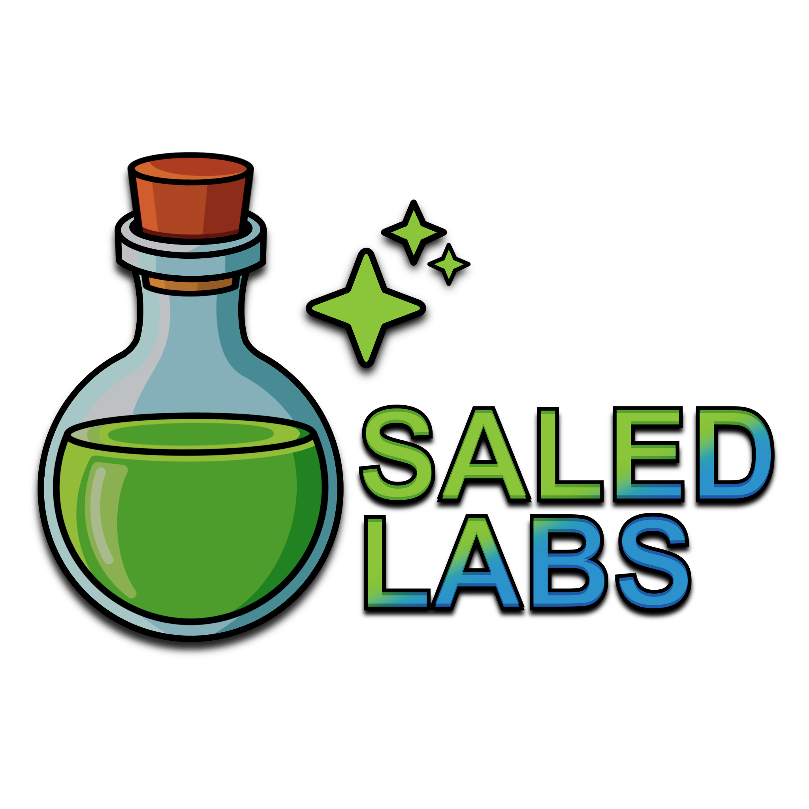

  

# King Saled | Founder of Saled Labs

### Tech Stack & Tools

  
  
  

---

### Currently Developing
**Jackpot Protocol** A 3D multiplayer casino experience set aboard a space station. 
* Built with a focus on light weight and performance
* Low poly art and textures done by me

You play as a floating CRT robot and can interact with s variety of casino games. The twist is, instead of gross micro-transactions, when you run out of money on the casino floor, there is a variety of carnival / arcade games to earn tickets. Convert those tickets back into cash and you're right back out there at the tables!

**Scapeith Idle** A web based idle RPG.

* Built with TypeScript, React and Phaser
* Tailwind for styling and snappy interactions

This is an Idle RPG heavily inspired by Runescape and Melvor Idle but built around my own world of Etivar, a large cotinent with 6 major cities including the capital of Etivar, Avloham. Featuring 14 different skills to train, combat, and a variety of things to explore on your own!

---

### GitHub Activity

  

  

